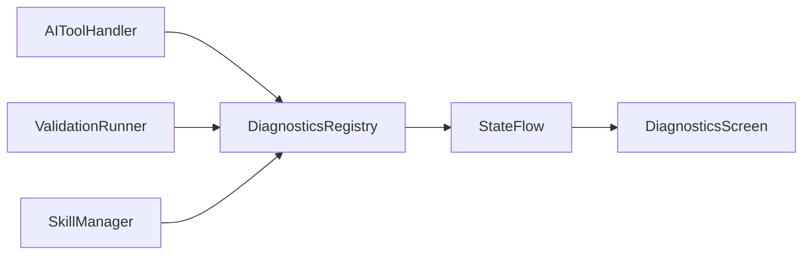

# 运行诊断仪表盘设计

Feature Name: runtime-diagnostics-dashboard
Updated: 2026-07-12

## 描述

该功能通过现有 `AIToolHook` 采集工具生命周期事件，使用进程内状态流向 Compose 页面提供实时快照。验证模块通过公开记录接口提交结果，后续 Room 持久化可以保持页面接口稳定。

## 架构

## 组件和接口

- `DiagnosticsRegistry`：注册全局工具 Hook，聚合活跃执行、工具统计、Skill 和验证记录。
- `DiagnosticsSnapshot`：诊断页面使用的不可变状态。
- `recordValidation`：供自验证模块写入验证结论的稳定接口。
- `DiagnosticsScreen`：使用 `LazyColumn` 展示指标卡片和明细列表。

## 数据模型

- `ToolDiagnosticStats`：调用次数、失败次数、平均耗时和派生失败率。
- `DiagnosticEvent`：事件时间、工具名、消息和可选执行结论。
- `ValidationDiagnostic`：验证时间、验证对象、结论和摘要。

## 正确性属性

- 每次工具开始事件最多增加一个活跃计数。
- 每次工具结束事件最多减少一个活跃计数。
- 失败次数小于或等于调用次数。
- 事件和验证记录集合具有固定上限。

## 错误处理

- Hook 回调由 `AIToolHandler` 隔离异常。
- Skill 扫描沿用 `SkillManager` 的错误收集机制。
- 空数据使用页面空状态表达。

## 测试策略

- 验证并发执行同名工具时的活跃计数。
- 验证成功、失败和异常路径的统计结果。
- 验证事件与验证记录达到上限后的淘汰顺序。
- 验证页面在空数据和高失败率数据下的渲染。
